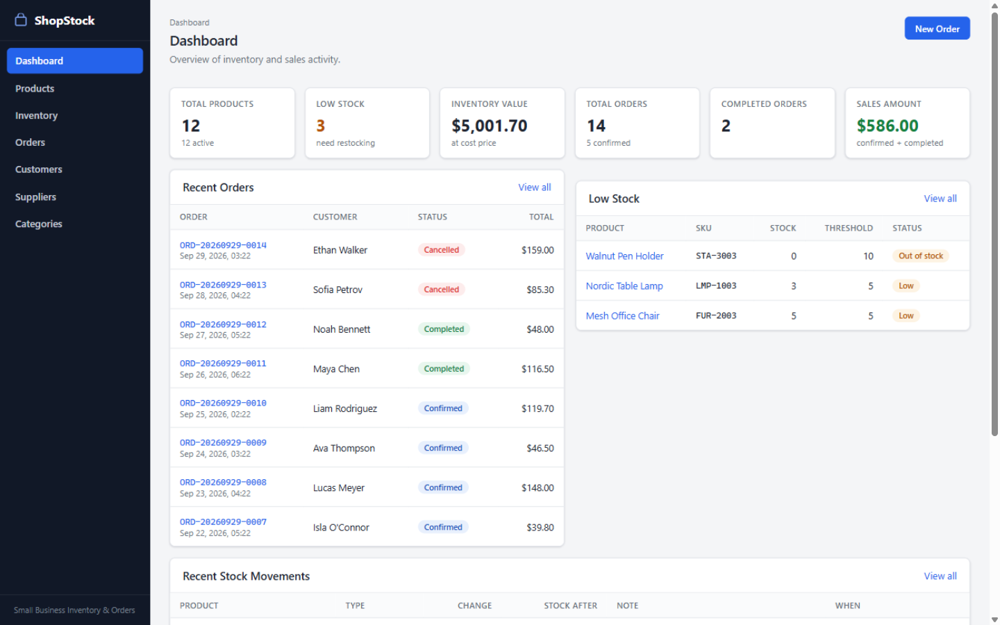
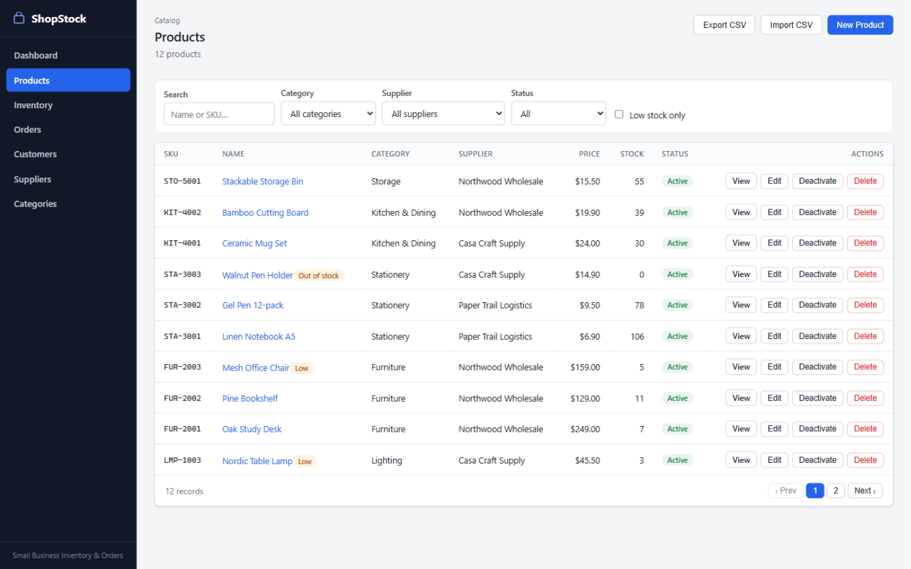
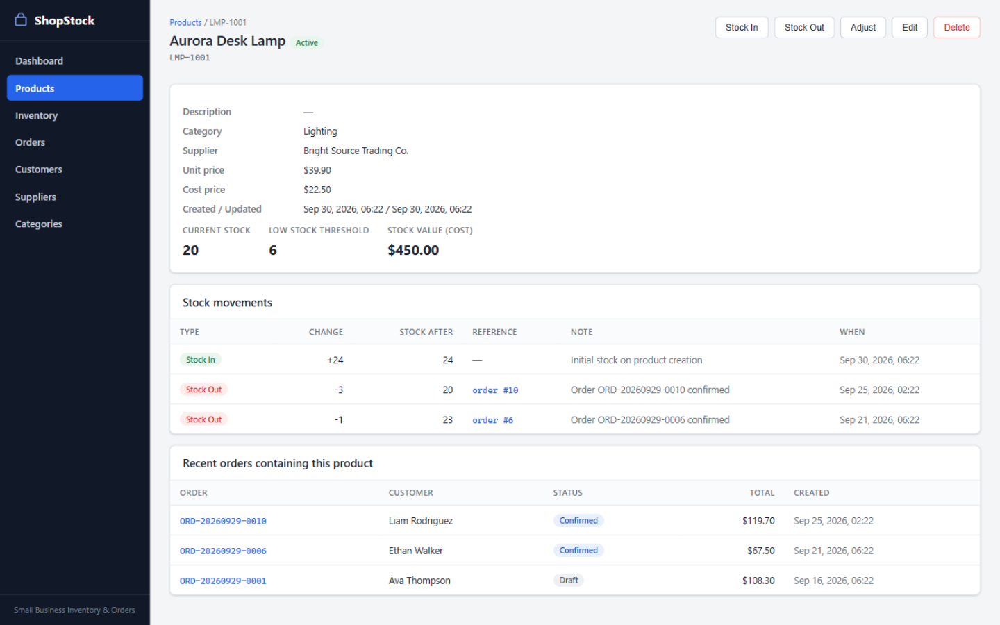
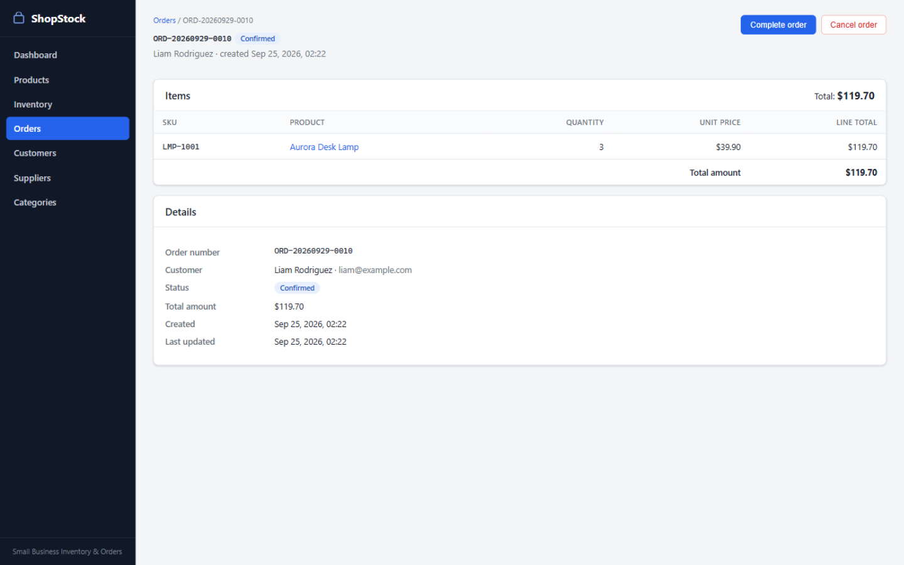
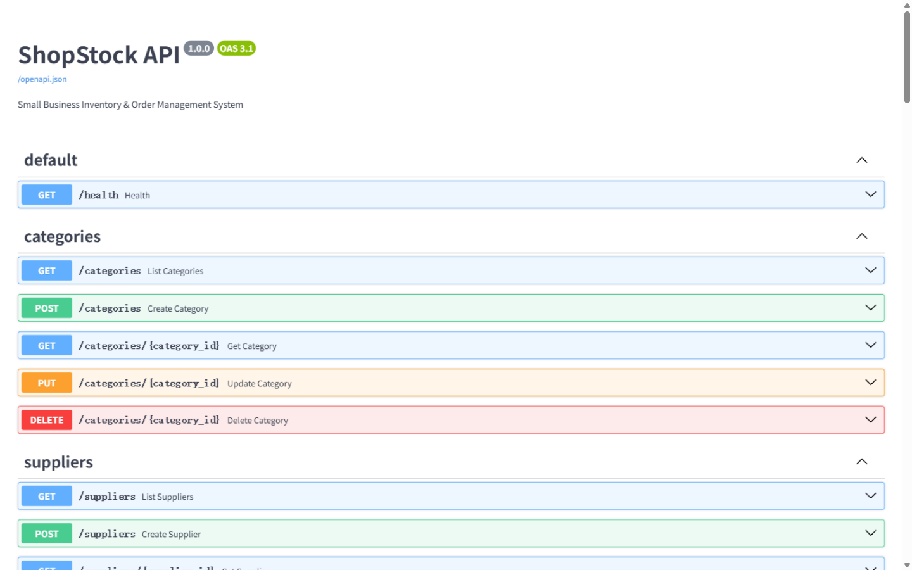
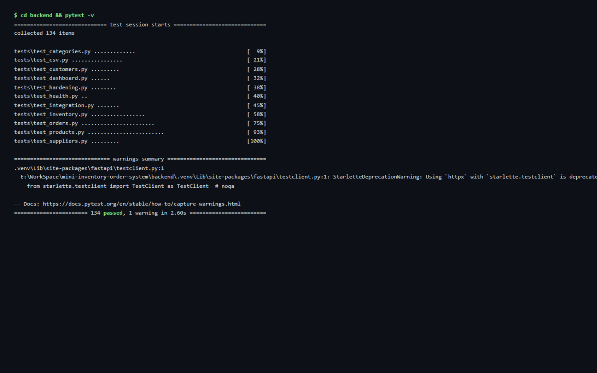

# ShopStock

A small business inventory & order management system — products, stock movements with a full audit trail, an order lifecycle (draft → confirmed → completed/cancelled), CSV import/export, and a dashboard.

> Independent portfolio project. Designed as a lightweight, small-business inventory/order application — not an enterprise ERP.

## Features

- **Products** — CRUD, SKU uniqueness, categories & suppliers, pricing (unit/cost), low-stock thresholds, activate/deactivate, search / filter / sort / pagination
- **Inventory** — Stock In / Stock Out / Stock Adjustment; every change writes a `StockMovement` audit record in the same database transaction; stock can never go negative; stock is never editable directly from the product form
- **Orders** — draft → confirmed (atomic stock deduction + OUT movements) → completed, or cancelled (confirmed orders restore stock with IN movements); server-generated order numbers (`ORD-YYYYMMDD-NNNN`); full state-machine validation
- **Customers / Suppliers / Categories** — CRUD with search, pagination, and referential-integrity protection (in-use records cannot be deleted)
- **Dashboard** — totals, inventory value at cost, order counts, sales amount, recent orders, low-stock list, recent movements
- **CSV** — product import with header validation and per-row error reporting; exports for products, orders (line-level) and stock movements, with CSV-injection sanitization
- **Database migrations** — Alembic with a baseline schema migration; new databases are created by `alembic upgrade head` (automatically on startup), and future schema changes ship as migrations
- **REST API** — FastAPI with OpenAPI docs, uniform error shape, correct status codes (404/409/422/500)

## Screenshots

| | |
|---|---|
|  |  |
|  |  |
|  |  |

The *product detail* screenshot shows the core business flow: a confirmed order produced a `Stock Out` movement (referenced to the order), and a cancelled confirmed order produced a `Stock In` movement restoring the stock.

## Tech Stack

- **Backend:** Python 3.11+, FastAPI, Pydantic v2, SQLAlchemy 2.x, Alembic, SQLite, Uvicorn
- **Frontend:** React 18, TypeScript, Vite, react-router, custom CSS (no UI framework)
- **Testing:** pytest (backend), Playwright (browser E2E)
- **Tooling:** Docker / docker-compose, GitHub Actions CI

## Architecture

```
┌─────────────┐   /api proxy    ┌──────────────────────────────────────────┐
│  Frontend   │ ───────────────►│  Backend (FastAPI)                       │
│  React+TS   │  nginx (prod)   │                                          │
│  Vite dev   │  vite (dev)     │  api routes  →  services  →  repositories│
└─────────────┘                 │  (thin I/O)     (business     (queries)  │
                                │                   rules)                 │
                                │                     ↓                    │
                                │              SQLAlchemy 2.x ORM          │
                                │                     ↓                    │
                                │            SQLite (FK enforced, Alembic) │
                                └──────────────────────────────────────────┘
```

Layering rules:

- API route handlers contain no business logic — they parse input and call services.
- All business rules (stock movements, order state machine, totals, CSV validation) live in the service layer.
- Repositories own queries; services own decisions.
- One database transaction per request: `get_db()` commits on success, rolls back on any error, so a failed order confirmation cannot leave partially-deducted stock.

## Business Rules

**Inventory**

- All stock changes go through `inventory_service.record_movement()` — the only place `stock_quantity` is mutated.
- Stock In / Stock Out take a positive quantity; Stock Adjustment sets an absolute counted quantity (signed delta recorded).
- `Stock Out` below zero is rejected (HTTP 409 `insufficient_stock`).
- Every change writes a `StockMovement` (type, quantity, `stock_after`, reference, note).

**Orders**

- `POST /orders` creates a **draft** (prices snapshotted per line).
- `POST /orders/{id}/confirm` (draft only), in one transaction: validates products & aggregated stock, computes totals, deducts stock, writes one OUT movement per line, sets status `confirmed`. Any failure ⇒ full rollback.
- `POST /orders/{id}/cancel`: draft → cancelled (no stock effect); confirmed → cancelled restores stock and writes IN movements.
- `POST /orders/{id}/complete`: confirmed → completed only.
- Transitions: `draft→confirmed/cancelled`, `confirmed→completed/cancelled`; `completed` and `cancelled` are terminal (violations return 409).
- Order numbers `ORD-YYYYMMDD-NNNN` are generated server-side and unique (DB constraint + retry on the unlikely race).

**Referential protection** — deleting is refused (409) for categories/suppliers used by products, customers with orders, and products with movements or order history (deactivate those instead).

**Low stock** — `stock_quantity <= low_stock_threshold` on active products; surfaced on the dashboard, in the product list, and via `GET /inventory/low-stock`.

## Database Migrations

Schema changes go through Alembic (`backend/migrations/`):

```bash
cd backend
alembic upgrade head      # apply all pending migrations
alembic current           # show the current revision
alembic downgrade base    # roll everything back (drops the tables)
alembic revision --autogenerate -m "describe change"   # create a new migration
```

- **Application startup runs `alembic upgrade head` automatically** (unless `APP_ENV=test`), so a fresh deployment only needs `DATABASE_URL` to point at an empty file.
- A pre-Alembic database (created by the old `create_all` bootstrap) is detected and stamped to `head` on first startup; later migrations then apply normally.
- The API test suite builds in-memory databases directly and does not use migrations.

## Data Model

```
Category 1─n Product n─1 Supplier
                    │
Customer 1─n Order 1─n OrderItem n─1 Product
                                        │
                                  StockMovement (product_id, type IN|OUT|ADJUSTMENT,
                                                 quantity, stock_after, reference, note)
```

Indexes on: `products.sku` (unique), `products.category_id`, `products.supplier_id`, `orders.order_number` (unique), `orders.status`, `orders.customer_id`, `stock_movements.product_id`, `stock_movements.created_at`. CHECK constraints keep prices/stock non-negative and order quantities positive. Timestamps are naive UTC.

## REST API

Interactive docs at `/docs` (Swagger UI) and `/openapi.json`.

| Area | Endpoints |
|---|---|
| Health | `GET /health` |
| Categories | `GET/POST /categories`, `GET/PUT/DELETE /categories/{id}` |
| Suppliers | `GET/POST /suppliers`, `GET/PUT/DELETE /suppliers/{id}` |
| Customers | `GET/POST /customers`, `GET/PUT/DELETE /customers/{id}` |
| Products | `GET/POST /products`, `GET/PUT/DELETE /products/{id}`, `GET /products/{id}/orders` |
| Inventory | `POST /products/{id}/stock/in|out|adjust`, `GET /products/{id}/stock/movements`, `GET /inventory/movements`, `GET /inventory/low-stock` |
| Orders | `GET/POST /orders`, `GET /orders/{id}`, `POST /orders/{id}/confirm|cancel|complete` |
| Dashboard | `GET /dashboard/summary` |
| CSV | `POST /products/import`, `GET /products/export.csv`, `GET /orders/export.csv`, `GET /inventory/movements/export.csv` |

List endpoints share the pagination contract `{items, total, page, page_size, total_pages}` with `?page=1&page_size=20&search=…` (`page_size` capped at 100). Errors are uniform: `{"error": {"code", "message"}}` — 404 not found, 409 conflicts/duplicates/illegal transitions/insufficient stock, 422 validation, 500 a generic safe message (no tracebacks).

## Local Development

Requirements: Python 3.11+, Node 18+ (Node 20 recommended).

```bash
# Backend
cd backend
python -m venv .venv
.venv/Scripts/pip install -e ".[dev]"        # Linux/macOS: .venv/bin/pip
.venv/Scripts/uvicorn app.main:app --reload  # API on http://localhost:8000, docs at /docs

# Frontend (second terminal)
cd frontend
npm install
npm run dev                                  # UI on http://localhost:5173 (proxies /api → :8000)
```

## Demo Data

```bash
cd backend
python -m app.seed           # seeds only if the database is empty (safe to run repeatedly)
python -m app.seed --reset   # explicit reset: deletes the SQLite file, re-migrates, seeds
```

Seeds **fictional** demo data: 5 categories, 4 suppliers, 8 customers, 12 products (3 low-stock, one out of stock), 14 orders across all statuses, 25+ stock movements. Normal startup never clears data — `--reset` is the only destructive path and must be typed explicitly.

## CSV Import / Export

Import (Products → Import CSV, or `POST /products/import`):

- Required header: `sku,name,category,supplier,unit_price,cost_price,stock_quantity,low_stock_threshold` (extra columns allowed, e.g. the export format)
- UTF-8 with or without BOM; whitespace around numbers tolerated; at most 5 MB per file
- Per-row validation: SKU format/uniqueness (in file & against DB, case-insensitive), numeric ranges, ≤2 decimal places, category/supplier must exist by name
- Bad rows are skipped and reported; good rows still import:

```json
{"total_rows": 5, "imported": 3, "skipped": 2, "errors": [{"row": 5, "message": "..."}]}
```

See [docs/sample-products.csv](docs/sample-products.csv) for an example (2 rows intentionally invalid).

Exports: `GET /products/export.csv`, `GET /orders/export.csv` (line-level), `GET /inventory/movements/export.csv`. Exported text cells are prefixed with `'` when they start with `= + - @` to neutralize spreadsheet formula injection.

## Testing

**Backend** — 134 pytest tests:

```bash
cd backend && pytest
```

Covers CRUD/validation/conflict handling per entity, the inventory rules (in/out/adjust, insufficient stock, movement integrity, rollback), the order state machine (confirm/cancel/complete, stock deduction & restoration, number generation), CSV import/export incl. BOM/whitespace/precision edge cases, dashboard aggregates, error-contract checks (uniform 500/405 bodies, no traceback leakage), and end-to-end integration tests over real HTTP against real SQLite — no mock database anywhere.

**E2E (browser)** — 11 Playwright tests driving the real app (Vite dev server + a dedicated, auto-migrated `e2e.db`):

```bash
cd frontend
npx playwright test          # starts backend (:8111) + frontend (:5177) automatically
npx playwright show-report   # HTML report
```

The core spec automates the full business chain: create product → stock in → stock out (incl. below-zero rejection) → create draft order → confirm (stock decreases) → cancel (stock restores) → low-stock view → CSV export downloads. Tests use role/label locators, no fixed sleeps, and a fresh database on every run (`frontend/e2e/global-setup.ts`).

## Docker

```bash
docker compose up --build
# UI:    http://localhost:8080
# API:   http://localhost:8000/docs
```

The SQLite file lives on a named volume (`backend-data`); the backend image contains the Alembic migrations and migrates on startup. Seed inside the container with `docker compose exec backend python -m app.seed`. Both images run as non-root where practical and define healthchecks; configuration is environment-variables only — no secrets are baked into images.

> **Docker status:** the Docker configuration is provided and reviewed, but runtime verification (compose build/up) was **not performed in this environment** because Docker is not installed here. The migration path it relies on (`alembic upgrade head` on startup) is verified locally.

## CI

Two workflows run on every push/PR:

- **`ci.yml`** — backend: `pytest` + an Alembic smoke test (empty DB → `upgrade head` → `downgrade base` → `upgrade head`); frontend: `npm ci` + `npm run build` (tsc type-check + Vite build)
- **`e2e.yml`** — separate workflow so the heavy browser install never blocks basic CI: installs the backend venv + chromium, runs the 11 Playwright tests

No external services required.

## Configuration

| Variable | Default | Purpose |
|---|---|---|
| `DATABASE_URL` | `sqlite:///./shopstock.db` | SQLAlchemy database URL (used by app, seed and Alembic) |
| `CORS_ORIGINS` | `http://localhost:5173,http://127.0.0.1:5173` | Comma-separated allowed browser origins |
| `APP_ENV` | `dev` | `test` skips auto-migration (used by the test suite); `production` marks the deployment mode |
| `LOG_LEVEL` | `INFO` | Application log level (DEBUG/INFO/WARNING/ERROR) |

See [backend/.env.example](backend/.env.example). The frontend never hardcodes a backend address: it calls relative `/api/...` URLs (Vite dev proxy, or the nginx proxy in Docker); set `BACKEND_URL` only to point the dev proxy elsewhere.

## Project Structure

```
backend/
├── app/
│   ├── main.py            FastAPI app, CORS, exception handlers, auto-migration
│   ├── config.py          environment settings (DATABASE_URL, CORS_ORIGINS, APP_ENV, LOG_LEVEL)
│   ├── database.py        engine/session, pragmas, get_db transaction
│   ├── migrations_runner.py  programmatic `alembic upgrade head` (+ legacy-DB stamp)
│   ├── models/            SQLAlchemy ORM entities
│   ├── schemas/           Pydantic request/response models
│   ├── repositories/      query layer
│   ├── services/          business logic (inventory, orders, CSV, dashboard)
│   ├── api/               route handlers
│   ├── utils/             UTC clock, CSV sanitization
│   └── seed.py            demo data CLI
├── migrations/            Alembic (baseline + future revisions)
├── tests/                 134 pytest tests
├── scripts/verify_api.py  live API smoke script
└── alembic.ini
frontend/
├── src/                   React app (api, components, pages, hooks, types, utils)
├── e2e/                   11 Playwright specs + global setup/teardown
└── playwright.config.ts   starts backend + frontend with a dedicated e2e.db
docs/
├── DEMO.md                step-by-step demo script
├── sample-products.csv    CSV import example (2 rows intentionally invalid)
└── screenshots/           real screenshots
```

## Security

- SQL access is fully parameterized through SQLAlchemy; user search input is LIKE-escaped.
- Exported CSV cells are neutralized against spreadsheet formula injection.
- The API never returns stack traces or filesystem paths: unexpected errors log server-side and return `{"error": {"code": "internal_error", "message": "An unexpected error occurred."}}` (covered by a regression test).
- CORS is an explicit allow-list from the environment; no credentials wildcard.
- All inputs are bounded (Pydantic length/range/pattern constraints, page_size ≤ 100, 5 MB CSV upload cap).
- Frontend renders data through React (no `dangerouslySetInnerHTML`); no secrets, keys, or absolute local paths are committed (checked).
- Debug mode is hard-disabled in all environments.

## Limitations

- **No authentication** — single-store, local/business-use application; authentication is outside the current scope.
- **No real payment processing** — order "confirmation" is an inventory reservation, not a payment.
- **SQLite** is used for simplicity; suitable for a single shop, not for concurrent multi-tenant scale. Concurrency is handled by short transactions and SQLite's own write serialization — no distributed locks (out of scope).
- **No email notifications** for low stock (view-only indicator).
- **No integrations** — no Shopify/WooCommerce/marketplace APIs; CSV is the exchange format.
- Docker runtime verification was not possible in the development environment (see Docker section).
- Order prices are snapshots; there is no order editing, discounts, or tax handling.

## Portfolio Notes

- Independent portfolio project built end-to-end: data model → service layer → REST API → UI → migrations → tests (unit/integration/E2E) → Docker → CI.
- The core value is the **transactional inventory engine**: every stock change is a movement, order confirmation is atomic, and the whole history is auditable (see the product-detail screenshot).
- All demo data is fictional; no real credentials, personal data, or third-party secrets are included.
